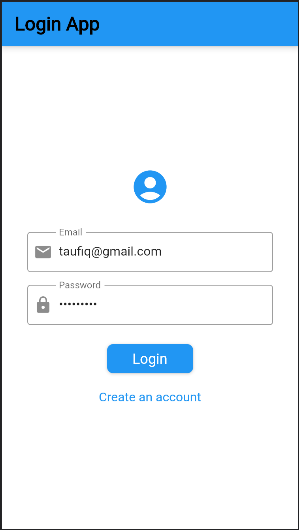
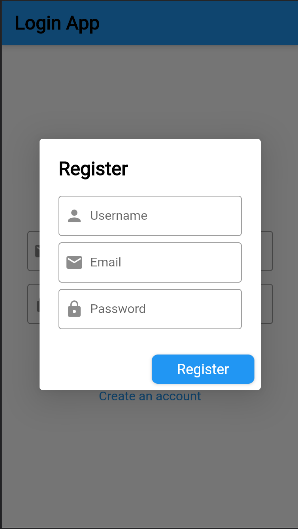
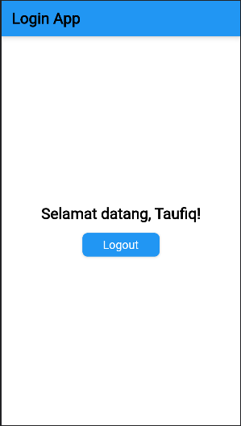

# aplikasi_login

A new Flutter project.

## Getting Started

This project is a starting point for a Flutter application.

A few resources to get you started if this is your first Flutter project:

- [Lab: Write your first Flutter app](https://docs.flutter.dev/get-started/codelab)
- [Cookbook: Useful Flutter samples](https://docs.flutter.dev/cookbook)

For help getting started with Flutter development, view the
[online documentation](https://docs.flutter.dev/), which offers tutorials,
samples, guidance on mobile development, and a full API reference.
# flutter-login-system

  

Berikut adalah penjelasan nya:

1. Kode di atas adalah aplikasi Flutter dasar dengan dua layar, yaitu layar login dan layar setelah login.
2. `MyApp` adalah widget utama yang mewarisi `StatelessWidget`.
3. Pada fungsi `build` dari `MyApp`, kita mendefinisikan `MaterialApp` sebagai root widget yang menyediakan tema dan layar beranda.
4. Di dalam `MaterialApp`, kita memiliki widget `Login` sebagai layar beranda awal.
5. `Login` adalah `StatefulWidget` yang memiliki dua keadaan: `isLoggedIn` untuk melacak status login dan `loggedInUserName` untuk menyimpan nama pengguna yang sedang login.
6. Saat `isLoggedIn` bernilai `true`, layar yang ditampilkan adalah `_buildLoggedInScreen`, yang menampilkan pesan selamat datang dan tombol logout.
7. Saat `isLoggedIn` bernilai `false`, layar yang ditampilkan adalah `_buildLoginScreen`, yang berisi formulir login.
8. Di `_buildLoginScreen`, terdapat `Form` yang menggunakan `_loginFormKey` sebagai kunci untuk validasi dan pengambilan nilai dari `TextFormField`.
9. `Image.network` digunakan untuk menampilkan gambar dari URL yang diberikan. Gambar tersebut diambil dari `https://via.placeholder.com/150`.
10. Terdapat dua `TextFormField` untuk masukan email dan password, yang masing-masing menggunakan `controller` untuk mendapatkan nilai masukan.
11. Tombol login akan memvalidasi formulir dan memeriksa apakah pengguna terdaftar atau tidak. Jika berhasil login, `isLoggedIn` akan diubah menjadi `true` dan `loggedInUserName` akan disetel dengan nama pengguna yang sedang login.
12. Jika login gagal, `SnackBar` akan ditampilkan dengan pesan "Invalid login credentials".
13. Terdapat juga tombol "Create an account" yang memunculkan dialog untuk registrasi. Dialog ini berisi formulir registrasi dengan tiga `TextFormField` untuk masukan username, email, dan password.
14. Saat tombol "Register" pada dialog registrasi ditekan, validasi akan dilakukan dan pengguna baru akan ditambahkan ke dalam daftar pengguna terdaftar.
15. Setelah pendaftaran berhasil, `SnackBar` akan ditampilkan dengan pesan "Registration successful".
16. Kode juga mencakup kelas `RegisteredUser` yang digunakan untuk menyimpan data pengguna yang terdaftar.

Kode ini mencakup logika untuk login, registrasi, dan tampilan yang lebih menarik dengan penggunaan ikon, gambar, dan penempatan teks di tengah.